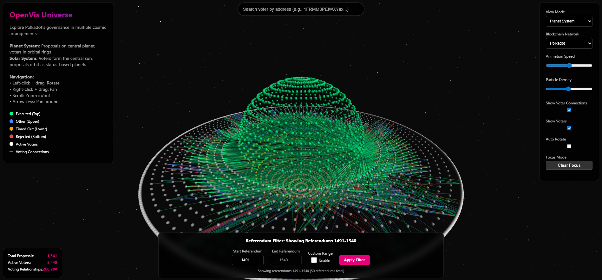

# 3D Opengov Visualisation

***

Jan 2025 - March 2025

Synopsis :&#x20;

* A stunning 3D visualization platform for exploring blockchain governance data, starting with Polkadot's OpenGov system. Experience governance relationships through immersive cosmic metaphors - from planetary systems to solar arrangements.

Tech Stack

Frontend Stack

* **Three.js**: 3D rendering and scene management
* **OrbitControls**: Camera navigation
* **WebGL**: Hardware-accelerated graphics
* **Vanilla JavaScript**: Core application logic

#### Data Processing

* **Neo4j Python Driver**: Database connectivity
* **Pandas**: Data manipulation and analysis
* **Batch Processing**: Memory-efficient data extraction

<figure><figcaption></figcaption></figure>



<table data-view="cards"><thead><tr><th align="center"></th><th data-hidden></th><th data-hidden></th><th data-hidden></th></tr></thead><tbody><tr><td align="center"><a href="https://open-vis-universe.vercel.app/">Website -></a></td><td></td><td></td><td></td></tr><tr><td align="center"><a href="https://github.com/BioChain-Network">GitHub -></a></td><td></td><td></td><td></td></tr></tbody></table>
