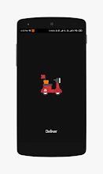
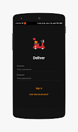
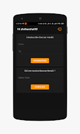
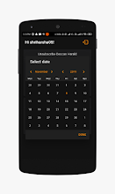
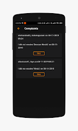
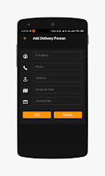

# Paperwala - Newspaper Delivery PWA

Nov 2021- Dec 2021&#x20;

Synopsis:

* Paperwala is a modern, user-friendly web application designed to streamline the process of subscribing to and managing newspaper deliveries in India.&#x20;
* The app provides a seamless experience for users to browse, subscribe, and track their newspaper deliveries.

#### Key Features:

1. **User Authentication**: Secure login system for personalized user experiences.
2. **Newspaper Subscriptions**:
   * Browse a variety of Indian newspapers
   * Subscribe or unsubscribe to multiple newspapers
   * View pricing and details for each newspaper
3. **Payment Processing**:
   * Seamless payment flow for subscriptions
   * Support for monthly and annual subscription models
4. **User Profile Management**:
   * Update personal information
   * Manage delivery address
5. **Real-time Delivery Tracking**:
   * An interactive map showing the newspaper delivery person's location
   * Estimated delivery time and distance calculation
   * Visual representation of the delivery route
6. **Subscription Management**:
   * View and manage active subscriptions
   * Track individual subscriptions
7. **Responsive Design**:
   * Mobile-friendly interface
   * Consistent user experience across devices

Tech Stack

* **Frontend Framework**:
  * React.js
  * Next.js for server-side rendering and routing
* **UI Components**:
  * Custom components using @/components/ui
  * Tailwind CSS for styling
* **State Management**:
  * React Hooks (useState, useEffect)
* **Mapping and Geolocation**:
  * React Leaflet
  * OpenStreetMap for map tiles
* **Icons**:
  * Lucide React for icon components
* **Development Tools**:
  * JavaScript (ES6+)
  * npm for package management

<figure><figcaption></figcaption></figure> <figure><figcaption></figcaption></figure> <figure><figcaption></figcaption></figure> <figure><figcaption></figcaption></figure> <figure><figcaption></figcaption></figure> <figure><figcaption></figcaption></figure> <figure><figcaption></figcaption></figure>

<table data-view="cards"><thead><tr><th align="center"></th><th data-hidden></th><th data-hidden></th><th data-hidden></th></tr></thead><tbody><tr><td align="center"><a href="https://github.com/ss-deshmukh/Paperwala-Newspaper-Delivery-App">GitHub -></a></td><td></td><td></td><td></td></tr></tbody></table>
